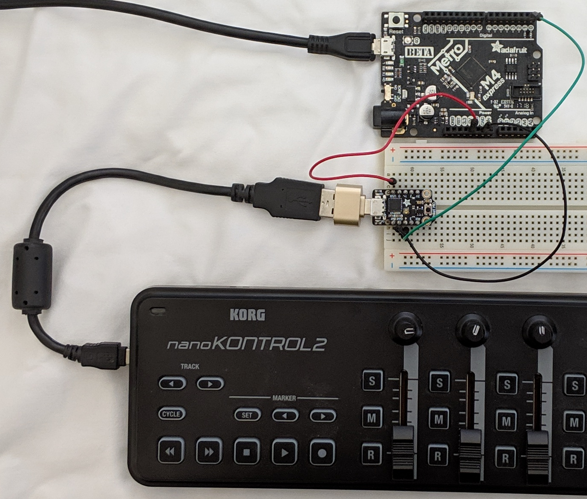

# Control NeoPixel using CircuityPython and USB MIDI controller

On the MIDI controller, moving fader 1 varies the red brightness, fader
2 varies the green brightness, and fader 3 varies the blue brightness.



## Hardware

* Metro M4 Express and on-board NeoPixel
* Trinket M0
* USB OTG to host cable or adapter
* MIDI controller (for example, Korg nanoKontroller)

## Connection

MIDI Controller <> USB OTG to host <> Trinket M0 <> Metro M4
(nanoKontrol)      cable or adapter   Arduino		CircuitPython


M4	|Trinket M0
----|----------
GND	|GND
5V	|USB
RX/0|TX/4

The M4 must receive 5V power because it powers the Trinket M0. Trinket M0 in
turn powers the USB MIDI device.

## Source code

* circuitpython/cpmidineo.py
* usbhostcopro/MIDIUARTUSBH.ino

### CircuitPython code

The CircuitPython program reads MIDI messages from UART Rx. Control Change
messages on Channel 1 control the red, green, and blue brightness of the
NeoPixel LED on the board.

```
# Metro M4 USB Host MIDI is connected to UART Rx

import time
import board
import neopixel
import busio

uart = busio.UART(board.TX, board.RX, baudrate=115200)

# Metro M4 has one LED
pixels = neopixel.NeoPixel(board.NEOPIXEL, 1, brightness=.2)

red_brightness = 0
green_brightness = 0
blue_brightness = 0

def pixels_update():
    #print(red_brightness, green_brightness, blue_brightness)
    pixels.fill((red_brightness, green_brightness, blue_brightness))
    pixels.show()

pixels_update()

while True:
    data = uart.read(1)
    #print(data)  # this is a bytearray type

    if data is not None:
        # if Change Control message on Channel 1
        if data[0] == 0xB0:
            control = uart.read(1)
            if control is not None:
                intensity = uart.read(1)
                if intensity is not None:
                    brightness = intensity[0] * 2
                    # Control 0 is for red
                    if control[0] == 0:
                        red_brightness = brightness
                        pixels_update()
                    # Control 1 is for green
                    elif control[0] == 1:
                        green_brightness = brightness
                        pixels_update()
                    # Control 2 is for blue
                    elif control[0] == 2:
                        blue_brightness = brightness
                        pixels_update()
```

### USB Host co-processor code

The USB Host co-processor is a Trinket M0 (or any other SAMD21 or SAMD51) board
using the
[USB Host Library for SAMD](https://github.com/gdsports/USB_Host_Library_SAMD).
This library is a port of the
[USB Host Shield Library 2.0](https://github.com/felis/USB_Host_Shield_2.0).

The SAMD21/SAMD51 USB port is capable of switching to USB host mode using
a [USB OTG to host cable](https://www.adafruit.com/product/1099) or adapter.

The Arduino sketch reads MIDI from the USB MIDI controller and writes the MIDI
message out the UART TX pin.  The UART TX pin is connected to the Metro M4 UART
RX pin. Both UARTs runs 115,200 bits/sec.

## Related projects/references

[MIDI DIN to MIDI USB Host Converter](https://github.com/gdsports/midiuartusbh)

[MIDI Messages](https://www.midi.org/specifications/item/table-1-summary-of-midi-message)

[USB Host Library for SAMD](https://github.com/gdsports/USB_Host_Library_SAMD)

[Arduino MIDI Library](https://github.com/FortySevenEffects/arduino_midi_library)

